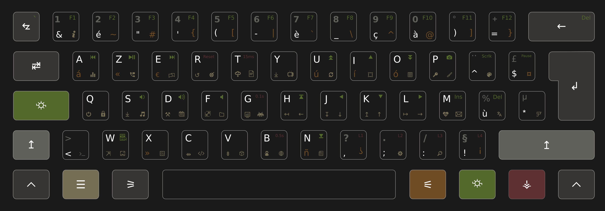

This layout is a custom design made for a [WASD VP3 62-Key ISO Custom](https://www.wasdkeyboards.com/wasd-vp3-62-key-iso-custom-mechanical-keyboard.html) mechanical keyboard. If follows WASD's specifications for layout design and can be used on their online shop to order a custom keyboard.

With the use of modifiers, each key can trigger up to 4 actions. The base layout is a french AZERTY, and spanish accented letters are also present.

